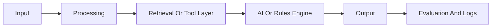

# Architecture Template

## Business Problem

Describe the business problem in plain language.

## Users

Describe the intended users or stakeholders.

## System Overview

## Components

| Component | Responsibility |
|---|---|
| App UI | User interaction |
| Data Layer | Synthetic or public data |
| Retrieval Layer | Search, filtering, or context lookup |
| AI Layer | LLM, rules, or agent workflow |
| Evaluation Layer | Tests, metrics, and review |

## Tradeoffs

List technical and business tradeoffs.

## Limitations

List what the project does not prove.
