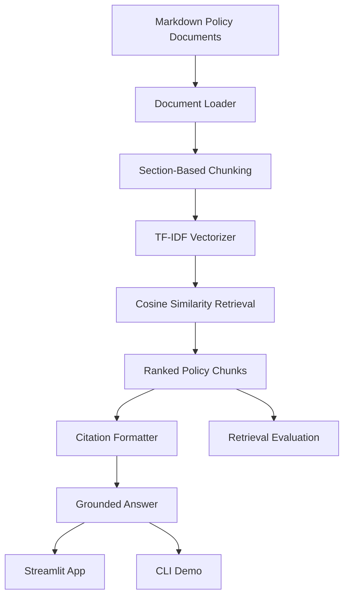

# Architecture

Policy RAG With Citations is a lightweight retrieval-augmented generation demo for policy question answering over synthetic markdown documents.

## System Flow

## Components

| Component | File | Purpose |
|---|---|---|
| Policy documents | `data/policies/*.md` | Synthetic workplace policy source material |
| Chunking | `src/chunking.py` | Loads markdown and splits policies by section |
| Retrieval | `src/retrieval.py` | Ranks chunks using TF-IDF cosine similarity |
| Citations | `src/citations.py` | Creates citation labels, sources, and grounded answers |
| Pipeline | `src/rag_pipeline.py` | Coordinates loading, retrieval, answering, and sources |
| Streamlit app | `app/streamlit_app.py` | Interactive demo interface |
| CLI query | `scripts/query_policy.py` | Terminal-based question answering |
| Evaluation | `scripts/evaluate_retrieval.py` | Measures top-1 retrieval accuracy |
| Demo outputs | `scripts/generate_demo_outputs.py` | Generates portfolio evidence examples |

## Citation Behavior

Every supported answer is tied to retrieved policy evidence. The answer includes a bracketed citation such as `[1]`, and the source table maps that citation to the policy title, policy section, source file, and retrieval score.

## Abstention Behavior

When retrieved evidence does not meet the minimum score threshold, the system avoids unsupported answers and returns a low-confidence abstention message.

## Baseline Design Choice

The repository uses TF-IDF retrieval rather than a hosted embedding model or vector database. This keeps the project easy to install, fast to run, and suitable for portfolio review while preserving the essential RAG workflow: ingestion, chunking, retrieval, citations, evaluation, and user-facing demo.
